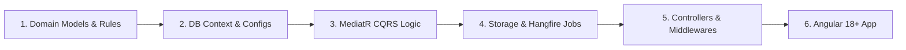

# AI Assisted Development Workflow & Strategy Report

This document outlines the collaborative engineering workflow, problems encountered, and optimization strategies applied during the development of the Claims Management System.

---

## 1. Development Sequence

We executed a systematic, bottom-up clean architecture implementation workflow:

### Execution Strategy
1.  **Strict Domain Focus**: The Domain Layer was scaffolded first without any external dependencies. This established robust base entities, domain events, and repository interfaces.
2.  **Decoupled Database Configs**: Database models were mapped purely with EF Core Fluent API configurations rather than inline data annotations, maintaining POCO integrity.
3.  **CQRS Architecture**: MediatR CQRS handlers separated Read queries from Write operations, simplifying validation checking.
4.  **Parallel Frontend Development**: SCSS themes and Angular standalone components were configured to bind directly to backend API DTO signatures.

---

## 2. Issues Encountered & Resolution Strategy

During compilation and integration phases, several cross-cutting technical issues arose. Below is how they were systematically resolved.

### Issue 1: Clean Architecture Dependencies & Circular Imports
*   **Problem**: In the initial design, the Application Layer attempted to directly query the database contexts or persistence repositories, which violates clean architecture boundaries (Application must not depend on Persistence implementations).
*   **Resolution**: Established abstract repository interfaces in the Domain Layer (e.g., `IAuditLogRepository`, `IClaimRepository`). The Persistence Layer implements these interfaces, and the Application Layer requests them strictly via Dependency Injection.

### Issue 2: Package Version Conflicts (WarningsAsErrors)
*   **Problem**: Project templates generated references to `Microsoft.EntityFrameworkCore` version `9.0.0` packages, but other packages pulled in dependencies of version `>= 9.0.7`. This mismatch triggered NuGet Package Downgrade warning `NU1605`. Because `WarningsAsErrors` was set to `true`, the project build failed.
*   **Resolution**: Systematically updated all package references across `.csproj` files to exactly version `9.0.7` for `Microsoft.Extensions.*` and EF Core packages.

### Issue 3: TypeScript Interface Mismatches
*   **Problem**: Differences in property names between backend DTO outputs and frontend interfaces (e.g., `clientName` vs. `insuredName` for policy, `reserveComponentId` vs. `id` for components, and `createdByUserId` vs. `performedByUserId` for audit logs) caused Angular template compilation failures.
*   **Resolution**: Audited TS model files, aligned all component markup and TypeScript logic to match the existing model definitions, and enriched `reserve.model.ts` to fully map the complex financial history records returned by the backend.

### Issue 4: SASS Specification Rules
*   **Problem**: The SASS compiler rejected `styles.scss` with error `NG9: @use rules must be written before any other rules` because an `@import` statement was placed on the first line.
*   **Resolution**: Reordered SASS declarations, placing the `@use '@angular/material' as mat` directive on line 1, before any web font imports.

---

## 3. Key Architectural Decisions & Validations

*   **Tenant Isolation**: Implemented global query filters instead of manual checking in repository layers to prevent security leaks.
*   **Simulated Testing Harness**: Created a mock login role switcher on the toolbar. This allows instantaneous switching of role context (Handler -> Supervisor -> Manager) to quickly test reserve approval thresholds and self-approval blocks without having to restart the application.
*   **Hangfire Resiliency**: Used local folder storage fallback alongside Docker SQL Server to ensure background GL posting queues are fully testable locally.
