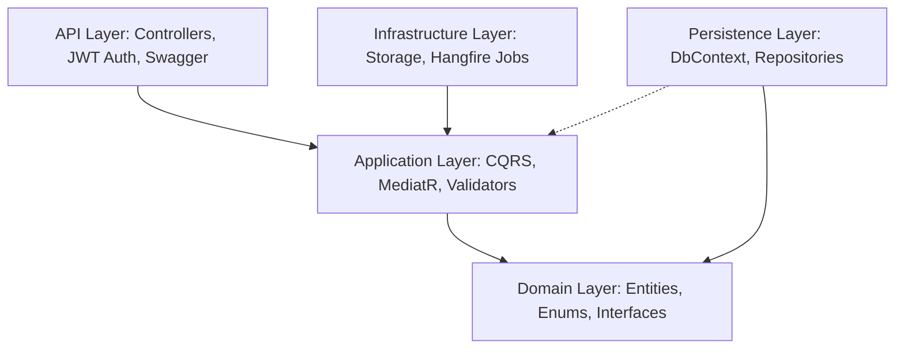
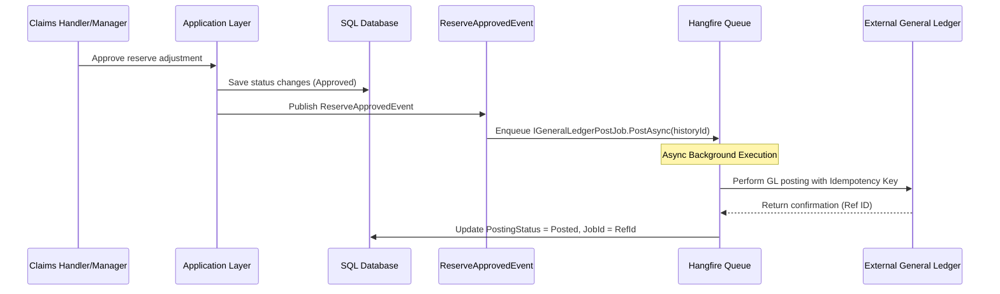

# Claims Management System Architecture Report

This document outlines the architectural patterns, security controls, and workflow integration implemented in the Claims Management Module (FNOL Intake & Reserve Management).

---

## 1. Clean Architecture Structure

The backend is built using **.NET 9** following the Clean Architecture pattern, enforcing strict dependency separation.



### Dependency Flow & Separation
*   **Domain**: 100% self-contained. Defines entities (`Claim`, `ReserveHistory`, etc.), enums, domain events, and core repository interfaces. It has no external package dependencies.
*   **Application**: Contains application business logic. Implements CQRS via **MediatR** commands and queries, **FluentValidation** pipeline behaviors, and **AutoMapper** profiles. It depends *only* on Domain interfaces.
*   **Persistence**: Implements data access using **Entity Framework Core 9**. Manages database configurations, audit triggers, and soft-delete filters. It depends on Domain and Application interfaces.
*   **Infrastructure**: Implements external concerns such as storage (`LocalStorageService` for dev fallback) and background processing (`Hangfire` queues).
*   **API**: Entry point. Orchestrates Dependency Injection, configures Swagger, validates JWT Bearer authentication, and handles global exceptions via Custom Middleware.

---

## 2. Multi-Tenancy & Tenant Isolation (BR-G-01)

Tenant isolation is enforced globally at the **Persistence** level using EF Core **Global Query Filters**.

### Design & Implementation
1.  **JWT Claims**: Every authenticated user token contains an `OrganizationId` claim mapped to their tenant.
2.  **DbContext Configuration**: The `ClaimsDbContext` resolves the current `organizationId` from the active HTTP request context (via `IHttpContextAccessor`).
3.  **Global Filter**: Entities implementing `IHasTenantIsolation` (e.g., `Claim`, `Policy`) are filtered automatically:
    ```csharp
    modelBuilder.Entity<Claim>()
        .HasQueryFilter(c => c.OrganizationEntityId == _currentTenantId);
    ```
    This guarantees that database operations (including repository reads) never leak data across tenants, even if a user attempts to bypass filters.

---

## 3. Financial Reserve Authority & Controls

The reserve workflow validates authority thresholds dynamically before committing transactions to the General Ledger.

### Authority Levels (BR-R-02)
*   **Auto-Approved**: Reserve adjustments $\le \$10,000$ are auto-approved, updating outstanding balances instantly.
*   **Supervisor Required**: Reserve adjustments $>\$10,000$ and $\le \$100,000$ go to `PendingApproval` and require a Supervisor or Manager role to authorize.
*   **Manager Required**: Reserve adjustments $>\$100,000$ go to `PendingApproval` and require a Manager role to authorize.

### Key Control Rules
*   **Self-Approval Block (BR-R-03)**: A user cannot approve a reserve transaction they submitted. The system compares the current user ID against `ReserveHistory.SubmittedByUserId` and blocks the request if they match.
*   **Aggregate Limit Check (BR-R-05)**: The sum of all active reserves on a single claim cannot exceed $\$10,000,000$. This check runs atomically during reserve creation.

---

## 4. Asynchronous General Ledger Posting (Hangfire)

When a reserve is approved (either auto-approved on intake or manually authorized by a manager), it must post to the General Ledger (GL).



### Idempotency & Resiliency
1.  **Idempotency Key**: Every reserve history record has an idempotency key structured as `Reserve:{ReserveId}:Change:{Sequence}`. This key is sent to the GL posting job to prevent double-posting in case of network retries.
2.  **Hangfire integration**: Hangfire provides automatic retry loops with exponential backoff if the external ledger API goes down.

---

## 5. Optimistic Concurrency (BR-G-02)

Optimistic concurrency is configured on high-activity financial tables (`Claim` and `ClaimReserveComponent`) using SQL Server `ROWVERSION` tokens.

### Configuration
In `ClaimConfiguration.cs` and `ClaimReserveComponentConfiguration.cs`:
```csharp
builder.Property(e => e.RowVersion)
    .IsRowVersion()
    .IsConcurrencyToken();
```
When two users attempt to adjust a reserve simultaneously, EF Core detects conflicting `RowVersion` bytes, throws a `DbUpdateConcurrencyException`, and the API Middleware converts it to a clean `409 Conflict` response to prevent data overwriting.

---

## 6. Document Management & Azure Storage Provider

Claim documents are uploaded and stored using a provider-agnostic abstraction configured at startup.

### Architecture & Interface Mappings
*   **Abstraction**: `IStorageService` handles blob upload, retrieval, and delete operations.
*   **Implementations**:
    1.  `AzureBlobStorageService`: Connects directly to Azure Blob Container (`claim-documents`). Generates secure, short-lived (1-hour TTL) pre-signed Shared Access Signature (SAS) URLs for viewing/downloading files securely from client browsers.
    2.  `LocalStorageService` (simulating `LocalFileSystemStorageService` in local development): Saves files under `/uploads/{organizationId}/{claimId}/` and returns local relative download paths.
*   **Configuration Switch (TZ compliance)**: The service provider is dynamically loaded via Dependency Injection based on the `StorageProvider` key in `appsettings.json`. Values can be:
    *   `AzureBlob`: Uses `AzureBlobStorageService` for production/cloud environments.
    *   `LocalFileSystem`: Uses `LocalStorageService` for local development setup.

